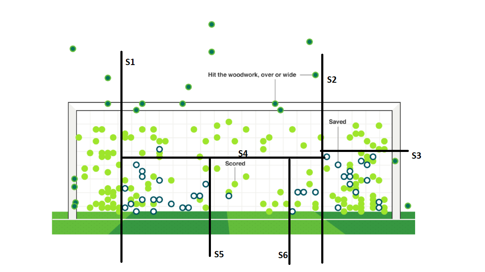

---
output:
  html_document: default
  pdf_document: default
---

## Problem 3 (2 + 2)
(a) (2 points) Manually sketch a decision tree to classify whether a shot will be scored or saved. The tree should make at least five splits.


(b) (2 points) Given a subset of the points, D, define its impurity as $Q(D) = 1-max_k\hat{p}_k$, where $\hat{p}\in[0,1]$ denotes the proportion of the points in D that belong to class k. In other words, $Q(D)$ is the remaining fraction once the most common class is removed.

Define the impurity of a split that splits D into two subsets $D1,D2$ as
$$
Q({D_1,D_2})=\sum_{i=1}^{2}\frac{|D_i|}{D}Q(D_i),
$$

where $|D_i|$ denotes the number of points in set $D_i$. Finally, define the gain of the split as
$$
Q(D) - Q({D_1,D_2})
$$
Use the above definitions and compute the gain of each split in your decision tree.

```{r}
splits <- 6
whites <- c(0,1,0,14,4,1,17)
whites <- sum(whites)
greens <- c(29,25,10,31,5,9,14)
greens <- sum(greens)
total <- whites + greens
message("Total:")
message(paste(whites, "whites"))
message(paste(greens, "greens"))
message(paste(whites, "+", greens, "=",total,"hits in total"))

#create data structure to collect the impurity & gain from each split

Imp = rep(0,splits)
Gains = rep(0,splits)
n <- 1
```

Split 1:
```{r}

#D total points left in to be split area
D <- total
#QD impurity of the current total area
QD <- D - sum(c(29,25,10,31,5,9,14))
#D1 number of points in area 1
D1 <- 29
#total number of points in max class in area 1
D1max <- 29
#D2 number of points in area 2
D2 <- D - D1
#D2max total number of points in max class in area 2
D2max <- sum(c(25,10,14,9,5,31))
#QD1 Purity of area 1
QD1 <- D1 - D1max
#QD2 Purity of area 2
QD2 <- D2 - D2max

#Impurity of split:
QD1D2 <- D1/D*QD1 + D2/D*QD2
Imp[n] <- QD1D2
#Gain of split:
Gain <- QD - QD1D2
Gains[n] <- Gain
n <- n+1

message("Result split 1:")
message(paste("D =",D))
message(paste("D1 =",D1))
message(paste("D1max =",D1max))
message(paste("D2 =",D2))
message(paste("D2max =",D2max))
message(paste("QD1 =",QD1))
message(paste("QD2 =",QD2))
message(paste("Impurity of split, QD1D2 =",QD1D2))
message(paste("Gain of split =",Gain))

```

Split 2:
```{r}

#D total points left in to be split area
D <- D2 
#QD impurity of the current total area
QD <- D - sum(c(25,10,31,5,9,14))
#D1 number of points in area 1
D1 <- sum(c(10,31,14))
#total number of points in max class in area 1
D1max <- 31+10
#D2 number of points in area 2
D2 <- D - D1
#D2max total number of points in max class in area 2
D2max <- sum(c(25,14,9,5))
#QD1 Purity of area 1
QD1 <- D1 - D1max
#QD2 Purity of area 2
QD2 <- D2 - D2max

#Impurity of split:
QD1D2 <- D1/D*QD1 + D2/D*QD2
Imp[n] <- QD1D2
#Gain of split:
Gain <- QD - QD1D2
Gains[n] <- Gain
n <- n+1


message("Result split 2:")
message(paste("D =",D))
message(paste("D1 =",D1))
message(paste("D1max =",D1max))
message(paste("D2 =",D2))
message(paste("D2max =",D2max))
message(paste("QD1 =",QD1))
message(paste("QD2 =",QD2))
message(paste("Impurity of split, QD1D2 =",QD1D2))
message(paste("Gain of split =",Gain))

```
Split 3:
```{r}

#D total points left in to be split area
D <- D1 
#QD impurity of the current total area
QD <- D - sum(c(10,31))
#D1 number of points in area 1
D1 <- sum(c(31,14))
#total number of points in max class in area 1
D1max <- 31
#D2 number of points in area 2
D2 <- D - D1
#D2max total number of points in max class in area 2
D2max <- sum(c(10))
#QD1 Purity of area 1
QD1 <- D1 - D1max
#QD2 Purity of area 2
QD2 <- D2 - D2max

#Impurity of split:
QD1D2 <- D1/D*QD1 + D2/D*QD2
Imp[n] <- QD1D2
#Gain of split:
Gain <- QD - QD1D2
Gains[n] <- Gain
n <- n+1


message("Result split 3:")
message(paste("D =",D))
message(paste("D1 =",D1))
message(paste("D1max =",D1max))
message(paste("D2 =",D2))
message(paste("D2max =",D2max))
message(paste("QD1 =",QD1))
message(paste("QD2 =",QD2))
message(paste("Impurity of split, QD1D2 =",QD1D2))
message(paste("Gain of split =",Gain))

```

Split 4:

```{r}

#D total points left in to be split area
D <- sum(c(25,1,14,17,9,1,5,4))
#QD impurity of the current total area
QD <- D - sum(c(25,14,9,5))
#D1 number of points in area 1
D1 <- sum(c(25,1))
#total number of points in max class in area 1
D1max <- 25
#D2 number of points in area 2
D2 <- D - D1
#D2max total number of points in max class in area 2
D2max <- sum(c(28))
#QD1 Purity of area 1
QD1 <- D1 - D1max
#QD2 Purity of area 2
QD2 <- D2 - D2max

#Impurity of split:
QD1D2 <- D1/D*QD1 + D2/D*QD2
Imp[n] <- QD1D2
#Gain of split:
Gain <- QD - QD1D2
Gains[n] <- Gain
n <- n+1


message("Result split 4:")
message(paste("D =",D))
message(paste("D1 =",D1))
message(paste("D1max =",D1max))
message(paste("D2 =",D2))
message(paste("D2max =",D2max))
message(paste("QD1 =",QD1))
message(paste("QD2 =",QD2))
message(paste("Impurity of split, QD1D2 =",QD1D2))
message(paste("Gain of split =",Gain))
```

Split 5:

```{r}

#D total points left in to be split area
D <- D2
#QD impurity of the current total area
QD <- D - sum(c(14,9,5))
#D1 number of points in area 1
D1 <- sum(c(14,17))
#total number of points in max class in area 1
D1max <- 17
#D2 number of points in area 2
D2 <- D - D1
#D2max total number of points in max class in area 2
D2max <- sum(c(9,5))
#QD1 Purity of area 1
QD1 <- D1 - D1max
#QD2 Purity of area 2
QD2 <- D2 - D2max

#Impurity of split:
QD1D2 <- D1/D*QD1 + D2/D*QD2
Imp[n] <- QD1D2
#Gain of split:
Gain <- QD - QD1D2
Gains[n] <- Gain
n <- n+1


message("Result split 5:")
message(paste("D =",D))
message(paste("D1 =",D1))
message(paste("D1max =",D1max))
message(paste("D2 =",D2))
message(paste("D2max =",D2max))
message(paste("QD1 =",QD1))
message(paste("QD2 =",QD2))
message(paste("Impurity of split, QD1D2 =",QD1D2))
message(paste("Gain of split =",Gain))
```

Split 6:

```{r}

#D total points left in to be split area
D <- D2
#QD impurity of the current total area
QD <- D - sum(c(9,5))
#D1 number of points in area 1
D1 <- sum(c(9,1))
#total number of points in max class in area 1
D1max <- 9
#D2 number of points in area 2
D2 <- D - D1
#D2max total number of points in max class in area 2
D2max <- sum(c(5))
#QD1 Purity of area 1
QD1 <- D1 - D1max
#QD2 Purity of area 2
QD2 <- D2 - D2max

#Impurity of split:
QD1D2 <- D1/D*QD1 + D2/D*QD2
Imp[n] <- QD1D2
#Gain of split:
Gain <- QD - QD1D2
Gains[n] <- Gain
n <- n+1


message("Result split 6:")
message(paste("D =",D))
message(paste("D1 =",D1))
message(paste("D1max =",D1max))
message(paste("D2 =",D2))
message(paste("D2max =",D2max))
message(paste("QD1 =",QD1))
message(paste("QD2 =",QD2))
message(paste("Impurity of split, QD1D2 =",QD1D2))
message(paste("Gain of split =",Gain))
print(Gains)
print(Imp)

plot(Imp)
plot(Gains)
plot(Imp,Gains)
```

```{r}

```


