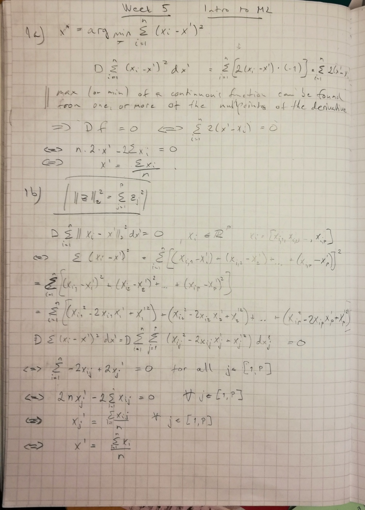
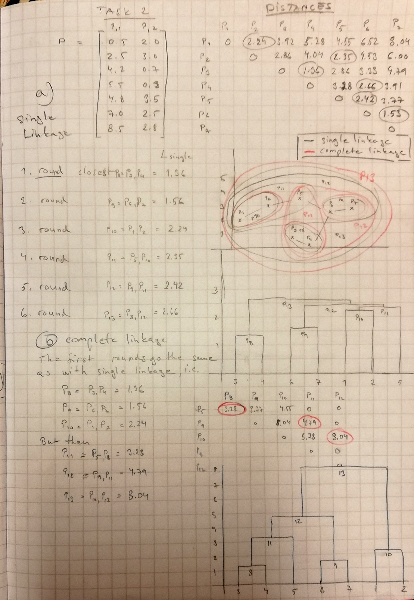

---
output:
  html_document: default
  pdf_document: default
---

## Problem 1



## Problem 2 



## Problem 3

Write your own implementation of the so called Lloyd's algorithm for K-means. The algorithm
is explained in the slides and Algorithm 10.1 in the textbook.
This should be a function that takes as inputs the data matrix, and outputs the final cluster means and the assignments specifying which data vectors are assigned to which cluster after convergence of the algorithm. (Use matrix operations wherever possible, avoiding explicit loops, to speed up the algorithm sufficiently for running the algorithm on the MNIST data below.)

### 3 a) Algorithm 10.1 K-Means Clustering:

- 1. Randomly assign a number, from 1 to K, to each of the observations. These serve as initial cluster assignments for the observations.
- 2. Iterate until the cluster assignments stop changing:
+ (a) For each of the K clusters, compute the cluster centroid. The kth cluster centroid is the vector of the p feature means for the observations in the kth cluster.
+ (b) Assign each observation to the cluster whose centroid is closest (where closest is defined using Euclidean distance).

```{r}
dist <- function(v1,v2)
{
  sqrt(sum((v1-v2)^2))
}
closest <- function(v1,clusters)
{
  mini <- 1
  mind <- dist(v1,clusters[1,])
  if(dim(clusters)[1]>1)
  {
    for(i in 2:dim(clusters)[1])
    {
      d <- dist(v1,clusters[i,])
      if(d < mind)
      {
        mini <- i
        mind <- d
      }
    }
  }
  return (mini)
}
```

#### KMeans function:

```{r}
Kmeans <- function(obs,K)
{
  #obs is a nxm matrix, with n observations and m features for each observation
  
  #Randomly assign a number, from 1 to K, to each of the observations. 
  #These serve as initial cluster assignments for the observations.
  
  #clt is a list of clusters, clusters represented as lists
  #each list item is a list of indices of the original list (row indices) of observations
  nobs <- dim(obs)[1]
  nfeat <- dim(obs)[2]
  clt <- sample(x=1:K, size=nobs, replace=TRUE)
  #initialize data structure for centroids
  cent <- matrix(0,nrow = K, ncol = nfeat)
  count <- 0

  #Make sure each cluster has at least one observation
  for (i in 1:K)
  {
    clt[i] = i
  }
  changed = TRUE
   
  while (changed && (count < 100)) 
  {   
    changed = FALSE
    oldclt <- clt
    #(a) For each of the K clusters, compute the cluster centroid. 
    #The kth cluster centroid is the vector of the p feature means 
    #for the observations in the kth cluster.
    for (i in 1:K)
    {
      #centroid of this cluster
      rows <- which(clt==i)
      if (length(rows) > 1)
      {
        cent[i,] <- colMeans(obs[rows,], na.rm = FALSE, dims = 1)
      }
      else
      {
        cent[i,] <- obs[rows[1],]
      }
    }
    
    #(b) Assign each observation to the cluster whose centroid is 
    #closest (where closest is defined using Euclidean distance).
    print(paste("Round:",count))

    for (i in 1:nobs)
    {
      clt[i] = closest(obs[i,],cent)
      if(clt[i] != oldclt[i])
      {
        changed <- TRUE
      }
    }    
    
    count <- count + 1
    #print(oldclt)
    #print(clt)
    
  }
  print(paste("Algorithm converged, total rounds: ", count))
  return (list(cent,clt))
}
```

#### Generate random sample from two normal distributions:

```{r}
library(zeallot)
x1 <- rnorm(100,0,1)
x2 <- rnorm(100,0,1)

#cents
#clids


```


#### Run KMeans many times on the same data:

```{r}
data <- cbind(x1, x2)
c(cents,clust) %<-% Kmeans(data,3)
plot(x1,x2,col=clust)
c(cents,clust) %<-% Kmeans(data,3)
plot(x1,x2,col=clust)
c(cents,clust) %<-% Kmeans(data,3)
plot(x1,x2,col=clust)
c(cents,clust) %<-% Kmeans(data,3)
plot(x1,x2,col=clust)
c(cents,clust) %<-% Kmeans(data,3)
plot(x1,x2,col=clust)
c(cents,clust) %<-% Kmeans(data,3)
plot(x1,x2,col=clust)
```

Conclusion: The clusters are surpricingly similar between different tries

### Task 3 b), MNIST data

#### Data download and verification

```{r}
# Load the MNIST digit recognition dataset into R
# http://yann.lecun.com/exdb/mnist/
# assume you have all 4 files and gunzip'd them
# creates train$n, train$x, train$y  and test$n, test$x, test$y
# e.g. train$x is a 60000 x 784 matrix, each row is one digit (28x28)
# call:  show_digit(train$x[5,])   to see a digit.
# brendan o'connor - gist.github.com/39760 - anyall.org

load_mnist <- function() {
  load_image_file <- function(filename) {
    ret = list()
    f = file(filename,'rb')
    readBin(f,'integer',n=1,size=4,endian='big')
    ret$n = readBin(f,'integer',n=1,size=4,endian='big')
    nrow = readBin(f,'integer',n=1,size=4,endian='big')
    ncol = readBin(f,'integer',n=1,size=4,endian='big')
    x = readBin(f,'integer',n=ret$n*nrow*ncol,size=1,signed=F)
    ret$x = matrix(x, ncol=nrow*ncol, byrow=T)
    close(f)
    ret
  }
  load_label_file <- function(filename) {
    f = file(filename,'rb')
    readBin(f,'integer',n=1,size=4,endian='big')
    n = readBin(f,'integer',n=1,size=4,endian='big')
    y = readBin(f,'integer',n=n,size=1,signed=F)
    close(f)
    y
  }
  train <<- load_image_file('./train-images-idx3-ubyte')
  test <<- load_image_file('./t10k-images.idx3-ubyte')
  
  train$y <<- load_label_file('./train-labels.idx1-ubyte')
  test$y <<- load_label_file('./t10k-labels.idx1-ubyte')  
}


show_digit <- function(arr784, col=gray(12:1/12), ...) {
  image(matrix(arr784, nrow=28)[,28:1], col=col, ...)
}

```

I could not make it work, so I extracted the local functions...

```{r}
aload_image_file <- function(filename) {
    ret = list()
    f = file(filename,'rb')
    readBin(f,'integer',n=1,size=4,endian='big')
    ret$n = readBin(f,'integer',n=1,size=4,endian='big')
    nrow = readBin(f,'integer',n=1,size=4,endian='big')
    ncol = readBin(f,'integer',n=1,size=4,endian='big')
    x = readBin(f,'integer',n=ret$n*nrow*ncol,size=1,signed=F)
    ret$x = matrix(x, ncol=nrow*ncol, byrow=T)
    close(f)
    ret
  }
aload_label_file <- function(filename) {
    f = file(filename,'rb')
    readBin(f,'integer',n=1,size=4,endian='big')
    n = readBin(f,'integer',n=1,size=4,endian='big')
    y = readBin(f,'integer',n=n,size=1,signed=F)
    close(f)
    y
  }


#load_mnist()
#show_digit(train$x[5,])
```

```{r}
train <<- aload_image_file('./train-images.idx3-ubyte')
```

```{r}
train <<- aload_image_file('./train-images.idx3-ubyte')
test <<- aload_image_file('./t10k-images.idx3-ubyte')

ytrain <<- aload_label_file('./train-labels.idx1-ubyte')
ytest <<- aload_label_file('./t10k-labels.idx1-ubyte')  
train$y = ytrain
test$y = ytest
  
```

#### Verify that data is ok:

```{r}
show_digit(train$x[5,])
```
```{r}
str(train)
str(test)
```

### 3 c) MNIST & KMeans

#### pick 500 digits for training

```{r}
newtrain = list()
newtrain$n <- 500
newtrain$x <- train$x[1:500,]
newtrain$y <- train$y[1:500]

```

#### Modify KMeans, initialisation of clusters with K first observations
```{r}
KmeansMod <- function(obs,K)
{
  #modified version, now initialize the clusters with first K observations
  
  #obs is a nxm matrix, with n observations and m features for each observation
  
  #Randomly assign a number, from 1 to K, to each of the observations. 
  #These serve as initial cluster assignments for the observations.
  
  #clt is a list of clusters, clusters represented as lists
  #each list item is a list of indices of the original list (row indices) of observations
  nobs <- dim(obs)[1]
  nfeat <- dim(obs)[2]
  clt <- sample(x=1:K, size=nobs, replace=TRUE)
  #initialize data structure for centroids
  cent <- matrix(0,nrow = K, ncol = nfeat)
  count <- 0

  #Make first 10 observations the cluster means
  for (i in 1:K)
  {
    clt[i] = i
    cent[i,] <- obs[i,]
  }
  changed = TRUE
   
  while (changed && (count < 100)) 
  {   
    changed = FALSE
    oldclt <- clt
    #(a) For each of the K clusters, compute the cluster centroid. 
    #The kth cluster centroid is the vector of the p feature means 
    #for the observations in the kth cluster.
    for (i in 1:K)
    {
      #centroid of this cluster
      rows <- which(clt==i)
      if (length(rows) > 1)
      {
        cent[i,] <- colMeans(obs[rows,], na.rm = FALSE, dims = 1)
      }
      else
      {
        cent[i,] <- obs[rows[1],]
      }
    }
    
    #(b) Assign each observation to the cluster whose centroid is 
    #closest (where closest is defined using Euclidean distance).
    print(paste("Round:",count))

    for (i in 1:nobs)
    {
      clt[i] = closest(obs[i,],cent)
      if(clt[i] != oldclt[i])
      {
        changed <- TRUE
      }
    }    
    
    count <- count + 1
    #print(oldclt)
    #print(clt)
    
  }
  print(paste("Algorithm converged, total rounds: ", count))
  return (list(cent,clt))
}

```

#### Run KMeans on MNIST 500 
```{r}
c(cents1,clust1) %<-% KmeansMod(newtrain$x,10)

```

#### Centroid images
```{r}
show_digit(cents1[1,])
show_digit(cents1[2,])
show_digit(cents1[3,])
show_digit(cents1[4,])
show_digit(cents1[5,])
show_digit(cents1[6,])
show_digit(cents1[7,])
show_digit(cents1[8,])
show_digit(cents1[9,])
show_digit(cents1[10,])

```
I can easily see many of the digits 0 - 9 represented here, 3, 9 and 8 seem to mix a bit, also 5 is bit fuzzy. Numbers 2, 3, 6, 7, 0 and 1 are somwht clear but there seems to be multiple 1 and also 9/4 mix


On some round I assessed training error (after self deciding the classes from the centroid images) and at it's best I reached error as low as 39%:
```{r}
#vals[clust]
vals <- c(9,0,6,5,4,1,3,2,7,8)
1-sum(vals[clust1]==train$y[1:500])/500

```

### 3 d) Modify KMeans, initialisation of cluster centroids with first occurrence of each label 0 - 9

```{r}
KmeansMod2 <- function(obs,K,labels)
{
  #modified version, now initialize the clusters with first instance if each K labels
  #Now it is more probable that each ith centroid will represent label i (not necessarily)
  
  #obs is a nxm matrix, with n observations and m features for each observation
  
  #Randomly assign a number, from 1 to K, to each of the observations. 
  #These serve as initial cluster assignments for the observations.
  
  #clt is a list of clusters, clusters represented as lists
  #each list item is a list of indices of the original list (row indices) of observations
  nobs <- dim(obs)[1]
  nfeat <- dim(obs)[2]
  clt <- sample(x=1:K, size=nobs, replace=TRUE)
  #initialize data structure for centroids
  cent <- matrix(0,nrow = K, ncol = nfeat)
  count <- 0

  #initialize the clusters with first instance of each K labels
  for (i in 1:K)
  {
    j <- 1
    #search for first occurrence of this label i
    while(labels[j] != (i-1))
    {
      j = j + 1
    }
    #set jth observation into cluster i
    clt[j] = i
    #set observation j as the centroid of cluster with label i
    cent[i,] <- obs[j,]
  }
  changed = TRUE
   
  while (changed && (count < 100)) 
  {   
    changed = FALSE
    oldclt <- clt
    #(a) For each of the K clusters, compute the cluster centroid. 
    #The kth cluster centroid is the vector of the p feature means 
    #for the observations in the kth cluster.
    for (i in 1:K)
    {
      #centroid of this cluster
      rows <- which(clt==i)
      if (length(rows) > 1)
      {
        cent[i,] <- colMeans(obs[rows,], na.rm = FALSE, dims = 1)
      }
      else
      {
        cent[i,] <- obs[rows[1],]
      }
    }
    
    #(b) Assign each observation to the cluster whose centroid is 
    #closest (where closest is defined using Euclidean distance).
    print(paste("Round:",count))

    for (i in 1:nobs)
    {
      clt[i] = closest(obs[i,],cent)
      if(clt[i] != oldclt[i])
      {
        changed <- TRUE
      }
    }    
    
    count <- count + 1
    #print(oldclt)
    #print(clt)
    
  }
  print(paste("Algorithm converged, total rounds: ", count))
  return (list(cent,clt))
}


```

#### Run KMeans

```{r}
c(cents2,clust2) %<-% KmeansMod2(newtrain$x,10,newtrain$y)
```
#### Centroid images

```{r}
show_digit(cents2[1,])
show_digit(cents2[2,])
show_digit(cents2[3,])
show_digit(cents2[4,])
show_digit(cents2[5,])
show_digit(cents2[6,])
show_digit(cents2[7,])
show_digit(cents2[8,])
show_digit(cents2[9,])
show_digit(cents2[10,])

```

```{r}
vals2 <- c(9,8,6,1,2,0,7,3,4,5)
1-sum(vals2[clust2]==train$y[1:500])/500
```
Well, now training error is more than 50%...
